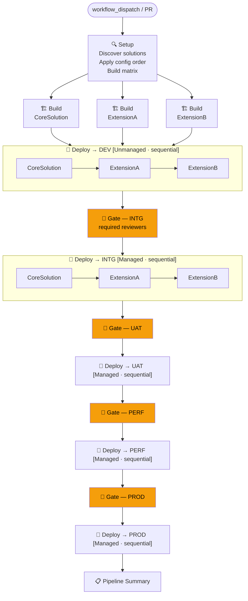
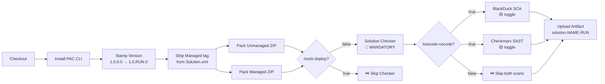
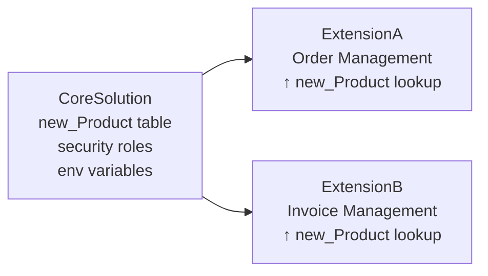
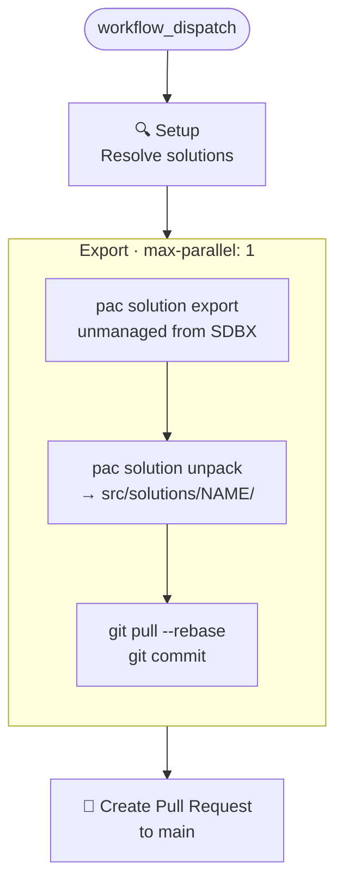
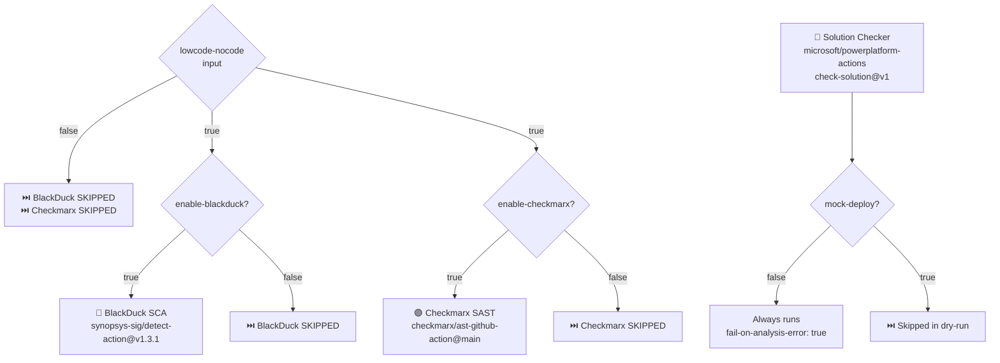
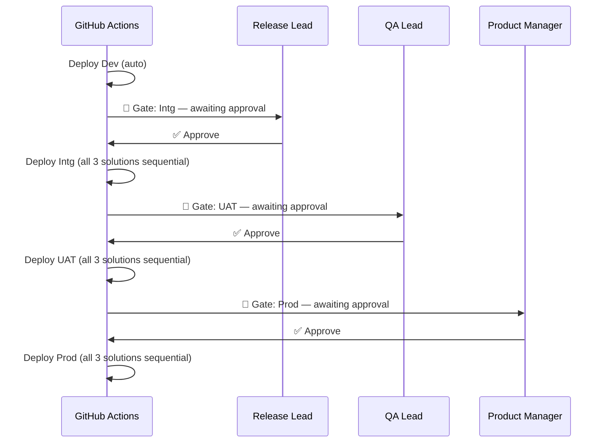

# GHA-Dynamics — Power Platform CI/CD Pipeline

> Enterprise-grade GitHub Actions pipeline for Microsoft Power Platform — supports single-solution and multi-solution repositories, sequential deployments, approval gates, security scanning, and safe dry-run simulation.

---

## Table of Contents

- [Overview](#overview)
- [Pipeline Flow](#pipeline-flow)
- [Repository Structure](#repository-structure)
- [Solution Structure](#solution-structure)
- [Workflows](#workflows)
- [Security Scanning](#security-scanning)
- [Configuration Reference](#configuration-reference)
- [GitHub Environments & Approval Gates](#github-environments--approval-gates)
- [Deployment Settings](#deployment-settings)
- [Running the Pipeline](#running-the-pipeline)
- [Local Dry-Run Simulation](#local-dry-run-simulation)
- [Troubleshooting](#troubleshooting)

---

## Overview

This repository implements a full Power Platform ALM pipeline using GitHub Actions reusable workflows. It handles:

- **Single-solution repos** — one solution in `src/solutions/`, auto-detected
- **Multi-solution repos** — N solutions with configurable deploy order and dependency management
- **Selective deployment** — deploy all, one, or any subset of solutions per run
- **Sequential deploys** — `max-parallel: 1` prevents Dataverse async operation conflicts
- **Approval gates** — one gate per environment covers all N solutions (no repeated approvals)
- **Mock deploy** — full pipeline dry-run with no actual Dataverse changes

### Sample Solutions in This Repo

| Solution | Type | Depends On |
|---|---|---|
| `CoreSolution` | Base — product table, security roles, env vars | — |
| `ExtensionA` | Order Management — new_order entity | CoreSolution (new_Product lookup) |
| `ExtensionB` | Invoice Management — new_invoice entity | CoreSolution (new_Product lookup) |

---

## Pipeline Flow

### Release Pipeline (full promotion chain)



### Build Job Detail



### Solution Dependency Order



### Export Flow (export-solution.yml)



---

## Repository Structure

```
GHA-Dynamics/
├── .github/
│   ├── solutions-config.json          # Deploy order + dependency docs
│   └── workflows/
│       ├── release-pipeline.yml       # Main: Dev → Intg → UAT → Perf → Prod
│       ├── export-solution.yml        # Export from sandbox, raise PR
│       ├── deploy-dev.yml             # Ad-hoc Dev deploy (no full promotion)
│       ├── rollback.yml               # Rollback a specific environment
│       ├── _reusable-build.yml        # Build + pack + scan (called by matrix)
│       └── _reusable-deploy.yml       # Deploy one solution (called by matrix)
│
├── src/
│   └── solutions/
│       ├── CoreSolution/
│       │   ├── [Content_Types].xml
│       │   └── Other/
│       │       ├── Solution.xml       # Version, publisher, components
│       │       └── Customizations.xml # Entity/component definitions
│       ├── ExtensionA/
│       └── ExtensionB/
│
├── config/
│   ├── CoreSolution/
│   │   └── data-schema.xml            # CMT schema for reference data export
│   ├── ExtensionA/
│   │   └── data-schema.xml
│   └── ExtensionB/
│       └── data-schema.xml
│
├── deployment-settings/
│   ├── dev/
│   │   ├── CoreSolution.json          # Env vars + connection refs for Dev
│   │   ├── ExtensionA.json
│   │   └── ExtensionB.json
│   ├── intg/
│   ├── uat/
│   ├── perf/
│   └── prod/
│
├── docs/
│   └── github-actions-run-guide.md    # Step-by-step GitHub Actions setup
│
├── scripts/
│   └── simulate-pipeline.py           # Local dry-run simulator
│
└── README.md
```

---

## Solution Structure

PAC CLI unpacks solutions into a specific folder layout. Always match this exactly:

```
src/solutions/<SolutionName>/
├── [Content_Types].xml              ← required at root, lists MIME types
├── Other/
│   ├── Solution.xml                 ← manifest: version, publisher, components
│   └── Customizations.xml           ← entity/component definitions
├── Entities/                        ← created by PAC unpack if entities exist
│   └── <EntityName>/
│       ├── Entity.xml
│       └── Attributes/
├── Workflows/                       ← Power Automate flows
│   └── <FlowName>-<guid>.json
├── EnvironmentVariableDefinitions/
└── SecurityRoles/
```

> **Important:** `Entities/`, `Workflows/` etc. sit directly under the solution root — **not** inside a `src/` subdirectory. PAC CLI dictates this layout on export.

### Solution.xml Key Fields

```xml
<ImportExportXml version="9.1.0.26671" SolutionPackageVersion="9.1">
  <SolutionManifest>
    <UniqueName>CoreSolution</UniqueName>
    <Version>1.0.0.0</Version>
    <!-- Do NOT include <Managed>0</Managed> — it blocks managed pack -->
    <Publisher>
      <UniqueName>pub_contoso</UniqueName>
      <CustomizationPrefix>new</CustomizationPrefix>
    </Publisher>
    <RootComponents>
      <RootComponent type="1" schemaName="new_Product" behavior="0" />
    </RootComponents>
  </SolutionManifest>
</ImportExportXml>
```

> **Note on `<Managed>` tag:** PAC CLI 1.40+ rejects a managed pack if `<Managed>0</Managed>` is present. The build workflow strips this tag automatically before packing, so exports from Dataverse work without manual intervention.

---

## Workflows

### `release-pipeline.yml` — Full Promotion Pipeline

**Trigger:** `workflow_dispatch` or PR to `main` touching `src/solutions/**`

| Input | Type | Default | Description |
|---|---|---|---|
| `solutions` | string | `all` | `"all"` or comma-separated: `"CoreSolution, ExtensionA"` |
| `target-environments` | choice | `all` | `all` \| `dev` \| `dev-intg` \| `dev-intg-uat` |
| `mock-deploy` | boolean | `false` | Dry-run — skip all imports, run all checks |
| `enable-backup` | boolean | `true` | Backup environment before deploy |
| `enable-blocking-check` | boolean | `true` | Abort on in-progress async operations |
| `enable-version-compare` | boolean | `true` | Verify version promoted correctly |
| `trigger-upgrade` | boolean | `false` | Holding-solution upgrade vs in-place update |
| `import-config-data` | boolean | `false` | Import CMT reference data after deploy |
| `lowcode-nocode` | boolean | `false` | Master toggle for BlackDuck + Checkmarx scans |
| `enable-blackduck` | boolean | `true` | BlackDuck SCA (only active if lowcode-nocode=true) |
| `enable-checkmarx` | boolean | `true` | Checkmarx SAST (only active if lowcode-nocode=true) |

### `export-solution.yml` — Export from Sandbox

**Trigger:** `workflow_dispatch`

Exports selected solutions from the sandbox, unpacks them into `src/solutions/`, commits, and opens a PR to `main`. Uses `max-parallel: 1` + `git pull --rebase` to prevent commit conflicts during multi-solution exports.

### `deploy-dev.yml` — Ad-hoc Dev Deploy

**Trigger:** `workflow_dispatch`

Deploys directly to Dev without running the full promotion chain. Useful for rapid iteration during development.

### `_reusable-build.yml` — Build & Pack

Called by the matrix in `release-pipeline.yml`. Per solution:
1. Installs PAC CLI
2. Stamps version: `Major.Minor.RunNumber.0`
3. Strips `<Managed>` tag from `Solution.xml`
4. Packs Unmanaged ZIP + Managed ZIP
5. Runs Solution Checker (mandatory unless mock-deploy)
6. Runs BlackDuck SCA + Checkmarx SAST (if toggled)
7. Uploads artifact: `solution-<Name>-<RunNumber>`

### `_reusable-deploy.yml` — Deploy to Environment

Called sequentially (max-parallel: 1) per environment. Per solution:
1. Downloads build artifact
2. Validates SPN auth (`who-am-i`)
3. Checks for blocking async operations
4. Compares version against previous environment
5. Resolves deployment settings file
6. Imports solution (unmanaged or managed)
7. Publishes customizations
8. Activates Power Automate flows
9. Imports configuration data (if toggled)

---

## Security Scanning



### Scan Toggle Matrix

| `lowcode-nocode` | `enable-blackduck` | `enable-checkmarx` | BlackDuck | Checkmarx | Solution Checker |
|---|---|---|---|---|---|
| `false` | any | any | ⏭️ Skip | ⏭️ Skip | ✅ Always |
| `true` | `true` | `true` | ✅ Run | ✅ Run | ✅ Always |
| `true` | `false` | `true` | ⏭️ Skip | ✅ Run | ✅ Always |
| `true` | `true` | `false` | ✅ Run | ⏭️ Skip | ✅ Always |
| `true` | `false` | `false` | ⏭️ Skip | ⏭️ Skip | ✅ Always |

---

## Configuration Reference

### GitHub Repository Secrets

Set at: **Settings → Secrets and variables → Actions → Secrets**

| Secret | Required | Description |
|---|---|---|
| `APP_ID` | ✅ | Azure AD App Registration client ID (SPN) |
| `CLIENT_SECRET` | ✅ | Azure AD App Registration client secret |
| `TENANT_ID` | ✅ | Azure AD tenant ID |
| `BLACKDUCK_URL` | If scanning | BlackDuck server URL |
| `BLACKDUCK_API_TOKEN` | If scanning | BlackDuck API token |
| `CHECKMARX_BASE_URI` | If scanning | Checkmarx AST base URI |
| `CHECKMARX_CLIENT_ID` | If scanning | Checkmarx client ID |
| `CHECKMARX_CLIENT_SECRET` | If scanning | Checkmarx client secret |
| `CHECKMARX_TENANT` | If scanning | Checkmarx tenant name |

### GitHub Repository Variables

Set at: **Settings → Secrets and variables → Actions → Variables**

| Variable | Required | Example | Description |
|---|---|---|---|
| `PP_DEV_URL` | ✅ | `https://contoso-dev.crm.dynamics.com` | Dev environment URL |
| `PP_INTG_URL` | ✅ | `https://contoso-intg.crm.dynamics.com` | Integration environment URL |
| `PP_UAT_URL` | ✅ | `https://contoso-uat.crm.dynamics.com` | UAT environment URL |
| `PP_PERF_URL` | ✅ | `https://contoso-perf.crm.dynamics.com` | Performance environment URL |
| `PP_PROD_URL` | ✅ | `https://contoso.crm.dynamics.com` | Production environment URL |
| `PP_SDBX_URL` | If exporting | `https://contoso-sdbx.crm.dynamics.com` | Sandbox URL (export source) |
| `PP_CHECKER_GEO` | Optional | `UnitedStates` | Solution Checker geography |
| `PP_DATA_SCHEMA_FILE` | Optional | `config/shared/data-schema.xml` | Shared CMT schema (per-solution schemas override this) |
| `PP_SOLUTION_NAME` | Optional | `MySolution` | Used only for single-solution repos without `src/solutions/` |

---

## GitHub Environments & Approval Gates



Create these environments at **Settings → Environments**:

| Environment | Protection Rule | Required Reviewers | Notes |
|---|---|---|---|
| `Dev` | None | — | Auto-deploys on every build |
| `Intg` | Required reviewers | Integration Lead | One approval covers all N solutions |
| `UAT` | Required reviewers | QA Lead | |
| `Perf` | Required reviewers | Perf Team Lead | |
| `Prod` | Required reviewers | Release Manager | |

> **GitHub plan note:** Required reviewers on private repos require GitHub Pro or Team. On free plans, make the repo public or remove the `environment:` declaration from gate jobs to let the pipeline flow unblocked.

---

## Deployment Settings

Each solution has a settings file per environment that injects connection references and environment variable values at deploy time.

### File Resolution Order

```
_reusable-deploy.yml resolves in this order:

1. deployment-settings/<env>/<SolutionName>.json   ← solution-specific (preferred)
2. deployment-settings/<env>/deployment-settings.json  ← legacy single-solution fallback
3. (none found) → deploy without overrides
```

### File Format

```json
{
  "EnvironmentVariables": [
    {
      "SchemaName": "new_ServiceEndpointUrl",
      "Value": "https://api.contoso.com/v1"
    }
  ],
  "ConnectionReferences": [
    {
      "LogicalName": "new_SharedDataverse",
      "ConnectionId": "#{PROD_DataverseConnectionId}#",
      "ConnectorId": "/providers/Microsoft.PowerApps/apis/shared_commondataservice"
    }
  ]
}
```

### Token Replacement

Values using `#{TOKEN_NAME}#` syntax are replaced at deploy time from GitHub Variables/Secrets. Store the actual IDs as repository secrets, not in the JSON files:

| Token | GitHub Secret/Variable |
|---|---|
| `#{Dev_DataverseConnectionId}#` | `Dev_DataverseConnectionId` variable |
| `#{PROD_DataverseConnectionId}#` | `PROD_DataverseConnectionId` secret |

### Settings Files in This Repo

| File | Environment Variables | Connection Refs |
|---|---|---|
| `dev/CoreSolution.json` | ServiceEndpointUrl, FeatureToggleEnabled | Dataverse, Office365 |
| `dev/ExtensionA.json` | OrderNotificationEmail | Dataverse, Office365 |
| `dev/ExtensionB.json` | InvoiceStorageUrl | Dataverse |
| `intg/`, `uat/`, `perf/`, `prod/` | Same keys, env-specific values | Env-specific connection IDs |

---

## solutions-config.json

Controls the deploy order for multi-solution repos. Without this file, solutions deploy alphabetically.

```json
{
  "_comment": [
    "Controls deployment order.",
    "CoreSolution must deploy first — ExtensionA and ExtensionB both depend on it."
  ],
  "solutions": [
    {
      "name": "CoreSolution",
      "description": "Base solution — deploy first."
    },
    {
      "name": "ExtensionA",
      "description": "Order Management — depends on CoreSolution."
    },
    {
      "name": "ExtensionB",
      "description": "Invoice Management — depends on CoreSolution."
    }
  ]
}
```

**Ordering rules:**
- Solutions listed here deploy in the specified order
- Solutions in `src/solutions/` but **not** in the config are appended alphabetically after the listed ones
- If the file is absent or invalid, all solutions deploy alphabetically

---

## Running the Pipeline

### Prerequisites

1. Azure AD App Registration with System Administrator access to all PP environments
2. GitHub repository secrets: `APP_ID`, `CLIENT_SECRET`, `TENANT_ID`
3. GitHub repository variables: `PP_DEV_URL`, `PP_INTG_URL`, `PP_UAT_URL`, `PP_PERF_URL`, `PP_PROD_URL`
4. GitHub Environments created: `Dev`, `Intg`, `UAT`, `Perf`, `Prod`

### Trigger a Full Dry-Run (recommended first run)

1. Go to **Actions → Release Pipeline → Run workflow**
2. Set inputs:

   | Input | Value |
   |---|---|
   | solutions | `all` |
   | target-environments | `all` |
   | mock-deploy | ✅ `true` |
   | enable-backup | ❌ `false` |
   | enable-blocking-check | ❌ `false` |
   | enable-version-compare | ❌ `false` |

3. Click **Run workflow**
4. Approve each gate as it pauses (Intg → UAT → Perf → Prod)
5. Check the **Summary** tab on the run for the full results table

### Trigger a Real Deploy

Same as above but set `mock-deploy: false`. All import, publish, and data steps will execute against the real environments.

### Deploy a Subset of Solutions

```
solutions: "CoreSolution, ExtensionA"
```

Only the listed solutions are built and deployed. The config ordering still applies within the subset.

### Limit Environments

```
target-environments: "dev-intg"
```

Pipeline stops after Intg — UAT/Perf/Prod jobs are skipped.

---

## Local Dry-Run Simulation

Simulates the full pipeline locally without GitHub Actions or Dataverse access. Reads real repo files (Solution.xml for versioning, deployment-settings JSON for token display, data-schema.xml for schema resolution).

```bash
# Full pipeline — all solutions, all environments
python3 scripts/simulate-pipeline.py --solutions all --run-number 42

# Specific solutions only
python3 scripts/simulate-pipeline.py --solutions CoreSolution,ExtensionA --run-number 99

# With security scans enabled
python3 scripts/simulate-pipeline.py --solutions all --lowcode-nocode --run-number 42

# Dev only
python3 scripts/simulate-pipeline.py --solutions all --target-envs DEV --run-number 42
```

**CLI flags:**

| Flag | Default | Description |
|---|---|---|
| `--solutions` | `all` | `all` or comma-separated solution names |
| `--run-number` | `42` | Simulated GitHub run number (affects version stamp) |
| `--target-envs` | All 5 | Comma-separated: `DEV,INTG,UAT` |
| `--lowcode-nocode` | off | Enable BlackDuck + Checkmarx simulation |
| `--no-blackduck` | — | Disable BlackDuck even if lowcode-nocode is on |
| `--no-checkmarx` | — | Disable Checkmarx even if lowcode-nocode is on |
| `--enable-backup` | off | Simulate backup step |
| `--trigger-upgrade` | off | Simulate holding-solution upgrade pattern |

---

## Troubleshooting

### Common Errors

| Error | Cause | Fix |
|---|---|---|
| `Solution.xml not found at expected path` | `Solution.xml` in wrong location | Move to `Other/Solution.xml` inside solution folder |
| `Cannot find required file Customizations.xml` | `Customizations.xml` in wrong location | Move to `Other/Customizations.xml` |
| `Solution package type did not match requested type` | `<Managed>0</Managed>` present in Solution.xml | Remove the `<Managed>` tag — the build workflow now does this automatically |
| `Object reference not set to an instance of an object` | Customizations.xml references entities PAC can't find | Clear entity references from Customizations.xml or ensure entity files exist at `Entities/<Name>/Entity.xml` |
| `Required property is missing: runs-on` | `environment:` used on a job that also has `uses:` | Remove `environment:` from reusable workflow call jobs — gate jobs are separate |
| `Repository not found` | Git not authenticated | Run `gh auth login` or use a PAT |
| `Unable to create index.lock` | Stale git lock file | `rm .git/index.lock` |
| `who-am-i` step fails | Invalid SPN credentials or SPN not added to PP environment | Verify App Registration and application user in each PP environment |

### Key Design Decisions

**Why `max-parallel: 1` on deploy jobs?**
Dataverse processes solution imports asynchronously. Parallel imports to the same environment cause async operation conflicts. Sequential import ensures each solution is fully processed before the next starts.

**Why a separate gate job instead of `environment:` on the deploy job?**
GitHub Actions does not allow `environment:` and `uses:` (reusable workflow call) on the same job. The gate job is a lightweight regular job (`runs-on: ubuntu-latest`) that carries the `environment:` declaration. One approval on the gate covers all N solutions in the subsequent matrix.

**Why is `<Managed>` removed from Solution.xml?**
PAC CLI 1.40+ strictly validates the `<Managed>` flag against `--packageType`. Source-controlled solutions are always unmanaged (`<Managed>0</Managed>`), but the build needs to produce both a `_unmanaged.zip` and a `_managed.zip`. Removing the tag lets PAC use the `--packageType` argument alone.

**Why `git pull --rebase` before each export commit?**
Multi-solution export runs with `max-parallel: 1`. Each solution export commits to the same branch. Without rebasing, the second commit fails because the remote has moved ahead after the first. `git pull --rebase` replays the new commit on top of the latest state.

---

## Contributing

1. Branch from `main`
2. Make changes to workflows or solution source
3. Test locally with `scripts/simulate-pipeline.py`
4. Push and trigger with `mock-deploy: true` to validate on GitHub Actions
5. Open a PR — the pipeline triggers automatically on PR to `main`
